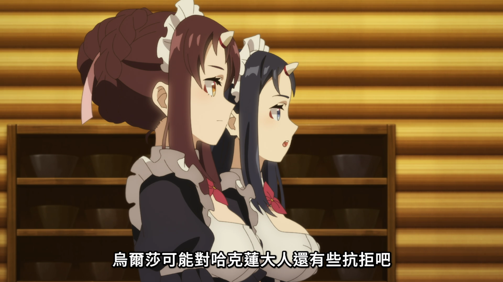

# 動畫瘋截圖小工具

這是一個給巴哈姆特動畫瘋使用的 Chrome 擴充功能。  
打開動畫瘋播放頁面後，你可以用按鈕或快捷鍵，手動截取目前瀏覽器畫面中的播放器截圖。
也可以直接在 Popup 主畫面製作短 GIF 小片段，適合保存幾秒鐘的畫面變化。

##(目前已3.0.1版本為主，請使用這個版本)

它適合用在：

- 想保存某一幕畫面。
- 想快速把畫面貼到筆記、聊天軟體或圖片工具。
- 想把截圖或 GIF 整理到固定下載資料夾。

這個工具只使用瀏覽器頁面中可取得的畫面。

不會下載影片、不會讀取影片串流，也不會嘗試繞過 DRM 或防截圖限制。

## 功能

- 只在 `https://ani.gamer.com.tw/*` 啟用。
- 支援 Popup 按鈕截圖。
- 支援頁面快捷鍵截圖，預設是 `Shift + C`。
- 支援頁面快捷鍵開啟 GIF 製作面板，預設是 `Shift + G`。
- 可用「錄製快捷鍵」的方式改快捷鍵。
- 會嘗試自動裁切動畫瘋播放器區域。
- 找不到播放器時，會改成截取目前可見畫面。
- 截圖格式為 PNG。
- 可自動下載截圖。
- 可複製截圖到剪貼簿。
- 可設定下載子資料夾，例如 `Downloads\AnimeScreenshots`。
- 可依動畫名稱自動建立資料夾。
- 可選輸出解析度：原始解析度、`720P`、`1080P`、`1440P`。
- 截圖成功或失敗時，會在頁面右上角與 Popup 顯示提示。
- 可輸入 GIF 開始時間、結束時間或秒數，最長 `10` 秒。
- GIF 會直接從頁面中的影片元素擷取影格，不包含聲音。
- GIF FPS 可選 `30 FPS`、`50 FPS`。
- GIF 可選解析度：`720P`、`1080P`、`1440P`。

## 功能展示




## 重要說明

這個工具不會繞過任何保護機制。

如果你截圖後看到黑畫面，通常代表網站、瀏覽器、作業系統或顯示卡正在保護該內容。這種情況下，工具只會顯示錯誤或照實保存目前可見結果，不會嘗試破解或繞過限制。

GIF 功能會直接從頁面中的影片元素擷取影格。

它不是影片下載工具，也不會取得影片檔案、音訊或串流內容。

## 下載 ZIP 後安裝

如果你只是想安裝使用，照這個方式做即可。

1. 下載 `anime-screenshot-extension-3.0.1.zip`。
2. 在電腦上找一個固定位置，把 ZIP 解壓縮。

建議放在類似這種資料夾：

```text
C:\Extensions\anime-screenshot-extension
```

3. 打開 Chrome。
4. 在網址列輸入：

```text
chrome://extensions
```

5. 打開右上角的「開發人員模式」。
6. 點「載入未封裝項目」。
7. 選擇剛剛解壓縮出來的資料夾。
8. 看到「動畫瘋截圖小工具」出現在擴充功能列表，就代表安裝完成。

注意：Chrome 要選的是「解壓縮後的資料夾」，不是 ZIP 檔本身。

## 更新版本

如果你之後下載了新版：

1. 先把新版 ZIP 解壓縮到原本的資料夾，覆蓋舊檔案。
2. 打開 `chrome://extensions`。
3. 找到「動畫瘋截圖小工具」。
4. 點「重新載入」。
5. 回到動畫瘋頁面並重新整理頁面。

## 使用方式

### 用按鈕截圖

1. 打開動畫瘋播放頁面。
2. 點 Chrome 工具列上的「動畫瘋截圖小工具」圖示。
3. 按「立即截圖」。
4. 如果成功，頁面右上角會出現「截圖成功」提示。

### 用快捷鍵截圖

在動畫瘋播放頁面按：

```text
Shift + C
```

這會直接截圖，不需要打開 Popup。

### 用快捷鍵開啟 GIF 製作

在動畫瘋播放頁面按：

```text
Shift + G
```

頁面右上角會顯示簡潔的 GIF 製作泡泡，全螢幕播放時也可以使用。

### 製作 GIF 小片段

1. 打開動畫瘋播放頁面。
2. 點 Chrome 工具列上的「動畫瘋截圖小工具」圖示。
3. 在主畫面的「GIF 小片段」區塊，輸入開始時間、結束時間或秒數。
4. 調整解析度與 FPS。
5. 按「開始製作 GIF」。
6. Popup 會顯示目前進度。
7. 完成後，頁面右上角會顯示「GIF 製作完成」，檔案會下載到設定的資料夾。

GIF 製作會參考 Userscript 的做法，使用 `requestVideoFrameCallback()` 從播放器連續取得影格。

## 設定

點 Popup 右上角的小齒輪，可以展開設定。

### 自動下載

開啟後，截圖成功會自動下載 PNG 圖片。

### 複製到剪貼簿

開啟後，截圖成功會嘗試把圖片複製到剪貼簿。  
你可以貼到支援圖片的聊天軟體、筆記軟體或圖片編輯工具。

### 下載子資料夾

Chrome 擴充功能不能直接指定任意電腦路徑，例如不能直接指定 `D:\圖片`。  
所以這個工具採用 Chrome 下載工具常見的方式：設定 Downloads 底下的子資料夾。

例如填入：

```text
AnimeScreenshots
```

圖片會存到：

```text
Downloads\AnimeScreenshots
```

如果留空，就會直接存到 Chrome 目前設定的下載資料夾。

### 依動畫名稱建立資料夾

開啟後，工具會在下載子資料夾底下再建立動畫名稱資料夾。

例如下載子資料夾是：

```text
AnimeScreenshots
```

動畫名稱是：

```text
某部動畫
```

圖片會存到：

```text
Downloads\AnimeScreenshots\某部動畫
```

如果下載子資料夾留空，則會存到：

```text
Downloads\某部動畫
```

### 輸出解析度

可以選：

- 原始解析度
- `720P`
- `1080P`
- `1440P`

解析度只會縮小圖片，不會把小圖放大。

### GIF 小片段

GIF 時間可以直接輸入開始時間、結束時間或秒數，最長 `10` 秒。

點「目前時間」會把時間軸同步到播放器目前位置，預設往後取 5 秒。

解析度可以選 `720P`、`1080P`、`1440P`。為了避免 GIF 過大，實際產生時會限制為適合 GIF 的輸出寬度。

FPS 可以選 `30 FPS`、`50 FPS`。

解析度越高，GIF 檔案越大，製作時間也會越久。

如果只是分享或快速保存，建議使用 `720P`。

### 修改快捷鍵

1. 點小齒輪。
2. 找到「頁面快捷鍵」或「GIF 製作快捷鍵」。
3. 點「錄製快捷鍵」。
4. 直接按你想設定的快捷鍵。

例如：

```text
Shift+C
Ctrl+Shift+S
Alt+S
```

如果改完快捷鍵後沒有反應，請重新整理動畫瘋頁面。

## 檔名格式

預設檔名：

```text
AnimeScreenshot_YYYY-MM-DD_HH-mm-ss.png
```

如果工具能取得動畫名稱，會改成：

```text
動畫名稱_YYYY-MM-DD_HH-mm-ss.png
```

GIF 檔名會使用：

```text
動畫名稱_YYYY-MM-DD_HH-mm-ss.gif
```

檔名會自動移除 Windows 不允許的特殊字元：

```text
\ / : * ? " < > |
```

## 專案檔案

```text
anime-screenshot-extension/
├─ manifest.json
├─ icons/
│  ├─ icon16.png
│  ├─ icon32.png
│  ├─ icon48.png
│  └─ icon128.png
├─ background.js
├─ content.js
├─ gif-encoder.js
├─ popup.html
├─ popup.js
├─ style.css
├─ offscreen.html
├─ offscreen.js
├─ README.md
└─ anime-screenshot-extension-3.0.1.zip
```

## 常見問題

### 為什麼截圖是黑畫面？

可能是網站、瀏覽器、作業系統或顯示卡的保護機制。這個工具不會繞過 DRM 或防截圖限制。

### 為什麼沒有裁切到播放器？

可能是動畫瘋頁面結構更新，或播放器還沒有載入完成。這時工具會改成截取目前可見畫面。

### 圖片到底下載到哪裡？

如果你設定了下載子資料夾，會在 Chrome 預設下載資料夾底下建立資料夾。  
例如設定 `AnimeScreenshots`，通常會在：

```text
Downloads\AnimeScreenshots
```

如果有開啟「依動畫名稱建立資料夾」，會再往下一層建立動畫名稱資料夾。

### 可以直接指定桌面或 D 槽嗎？

不行。Chrome 下載 API 不允許擴充功能直接指定任意絕對路徑。你可以到 Chrome 設定裡更改預設下載位置，再用本工具設定子資料夾。

### 可以下載影片嗎？

不行。這個工具不提供影片下載，也不會讀取影片串流。

### GIF 有聲音嗎？

沒有。GIF 格式本身不包含聲音，這個工具只會輸出動畫圖片。

### 為什麼 GIF 製作時播放器會播放一小段？

GIF 會用 `video + canvas` 逐格擷取影片畫面。為了取得指定時間範圍內的影格，工具會短暫 seek 到不同時間點，完成後會盡量回到原本位置。
